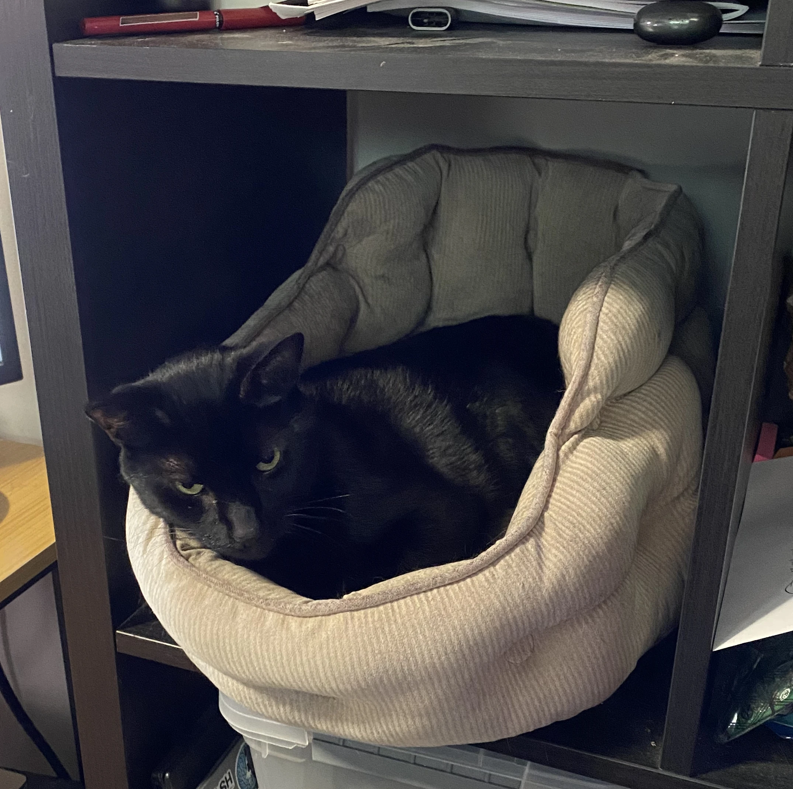
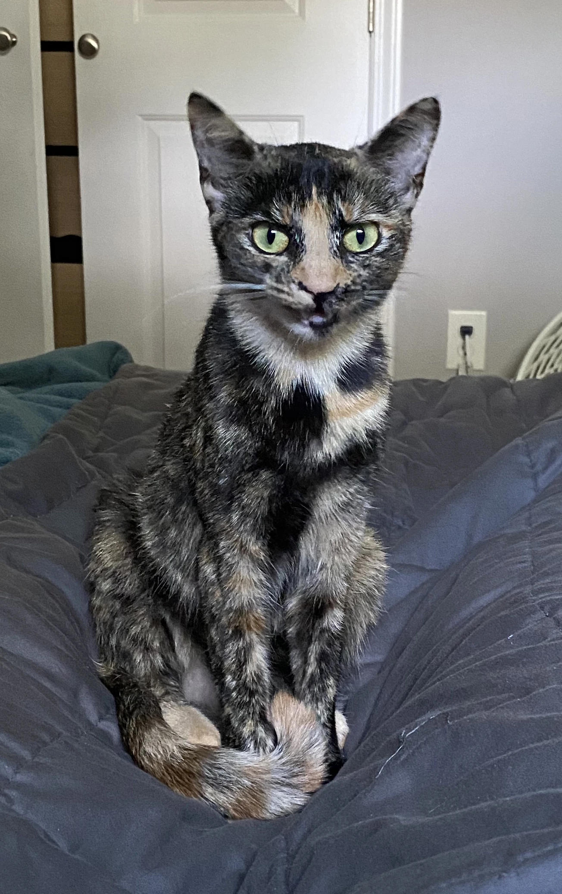


Hello! ¡Hola! 你好！ Kia ora!


I'm Whit, a Computer Science student at the University of North Carolina at Charlotte (concentration in Software, Systems, and Networks) graduating May 2025. I have been programming computers since the age of 13, learning under [Mr. Rob Muhlestein](https://github.com/rwxrob). This education and subsequent work instilled within me a love for the nitty-gritty of computers; starting out with DigitalOcean Droplets running Minecraft, I now apply that drive in honing my DevOps and SRE skills. Personally, this is through my [self-hosted homelab Kubernetes cluster](https://github.com/dotfilesh/ops); academically, this is through my coursework and concentration; and professionally, through my multiple certifications.

I am looking for opportunities to work following my graduation both in the United States (where I am able to work without restriction) and New Zealand (where I am Visa Ready for any accredited employer).

Feel free to reach out, I am always happy to talk.

# Personal Tidbits

| Riku, my black cat | Manana, my tortie cat |
|:--:|:--:|
|  |  |

- I have two cats: Riku (black) and Manana (tortie),
- I am keen on travel,
- I am off-and-on learning three languages: Español, te reo Māori, and 汉语.
- I am a fan of visual novels JRPGs, and still play Team Fortress 2 in 2025,
- I am an avid fan of swimming, paddle boarding, and really anything in the water.